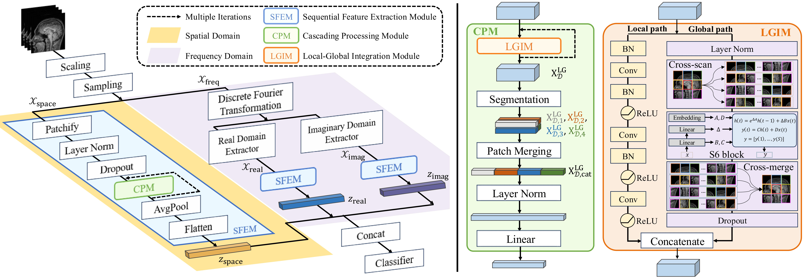

# HSFNet

Magnetic resonance (MR) image quality assessment is essential for disease diagnosis and data analysis. However, previous methods typically treat MR signals as general images and process them with vision-oriented approaches that overlook the sequential nature. Besides, existing datasets are often limited by small sample sizes, insufficient annotators, and a lack of fine-grained labels. In this paper, we propose a hybrid spatial-frequency network (HSFNet) with enhanced Mamba for MR image quality assessment, which extracts quality features from both spatial and frequency domains. Within each data domain, the local image features and global sequence insights are integrated through a dual-pathway mechanism inspired by Mamba. To further enhance the robustness of quality features, a novel iterative cascading process is introduced. Moreover, we establish a large-scale benchmark dataset for MR image quality assessment by simulating five distortion types across four severity levels, ensuring strong alignment with clinical experience. The benchmark dataset involves 8 sub-datasets, containing 7,122 raw images and 142,440 distorted versions. Extensive experiments on both T1-weighting and T2-weighting MR datasets demonstrate the proposed method's effectiveness and generalization ability in comparison with state-of-the-art MR image quality assessment methods. 

<div align=center></div>


## Initialize python environment.

```
git clone https://github.com/cyfqylyw/HSFNet.git
cd HSFNet
conda create -n mriqa python=3.9
conda activate mriqa
pip install -r requirements.txt
```


## Benchmark dataset construction.

### 1. Datasets preparation

Change directory to `datasets` folder

```
cd datasets
```


**Download [OASIS](https://sites.wustl.edu/oasisbrains/home/oasis-1/) dataset**

```
cd OASIS
chmod +x download_oasis.sh
./download_oasis.sh
```


**Download [NFBS](http://preprocessed-connectomes-project.org/NFB_skullstripped/index.html) dataset**

```
mkdir NFBS
cd NFBS
wget https://fcp-indi.s3.amazonaws.com/data/Projects/RocklandSample/NFBS_BEaST_Library.tar
tar -xvf NFBS_BEaST_Library.tar
```


**Download [IXI](https://brain-development.org/ixi-dataset/) dataset**

```
wget http://biomedic.doc.ic.ac.uk/brain-development/downloads/IXI/IXI-T1.tar
wget http://biomedic.doc.ic.ac.uk/brain-development/downloads/IXI/IXI-T2.tar

mkdir IXI-T1
tar -xvf IXI-T1.tar -C IXI-T1

mkdir IXI-T2
tar -xvf IXI-T2.tar -C IXI-T2
```


**Download [QTAB](https://openneuro.org/datasets/ds004146/versions/1.0.4) dataset using [AWS CLI](https://aws.amazon.com/cli/)**

```
mkdir QTAB
cd QTAB
aws s3 sync --no-sign-request s3://openneuro.org/ds004146 ds004146-download/
```


**Download [ARC](https://openneuro.org/datasets/ds004884/versions/1.0.1) dataset using [AWS CLI](https://aws.amazon.com/cli/)**

```
mkdir ARC
cd ARC
aws s3 sync --no-sign-request s3://openneuro.org/ds004884 ds004884-download/
```

### 2. Distortion Simulation

To establish the large-scale benchmark dataset, use the following code to generate distortion.

```
python transform.py

python distortion.py --dist motion
python distortion.py --dist ghosting
python distortion.py --dist spike
python distortion.py --dist noise
python distortion.py --dist blur
```

Specifically, we generate five types of distortion and four levels for each with [TorchIO](https://torchio.readthedocs.io) library. The parameters for distortion are:

| Distortion type     | Parameter        | Level 1      | Level 2      | Level 3      | Level 4      |
|---------------------|------------------|--------------|--------------|--------------|--------------|
| Random Motion       | translation      | (0,1)        | (4,5)        | (9,10)       | (19,20)      |
|                     | num_transforms   | 1            | 3            | 5            | 10           |
| Random Ghosting     | intensity        | (0.8,1.0)    | (1.5,1.7)    | (2.5,2.7)    | (5.0,5.2)    |
|                     | num_ghosts       | 4            | 6            | 11           | 21           |
| Herringbone Artifact| intensity        | (0.8,1.0)    | (1.0,1.2)    | (1.2,1.4)    | (2.0,2.2)    |
|                     | num_spikes       | 2            | 4            | 7            | 7            |
| Random Blurring     | std              | (0.8,0.9)    | (1.2,1.3)    | (2.5,2.6)    | (5.0,5.1)    |
| Gaussian Noise      | std              | 100.0        | 400.0        | 800.0        | 3000.0       |


### 3. Overview of the datasets

| Dataset | Year | # Subjects | # Images | # Samples | Format | Shape |
| :---: | :---: | :---: | :---: | :---: | :---: | :---: |
| OASIS (T1w) | 2007 | 416 | 1688 | 33760 | .img | (256, 256, 128, 1) |
| NFBS (T1w) | 2011 | 125 | 125 | 2500 | .mnc |  (193, 229, 193)  |
| IXI (T1w) | 2008 | 581 | 581 | 11620 | .nii.gz | (256, 256, 130-150) |
| IXI (T2w) | 2008 | 578 | 578 | 11560 | .nii.gz | (256, 256, 120-150) |
| QTAB (T1w) | 2022 | 417 | 1441 | 28820 | .nii.gz | (176-208, 300, 320) |
| QTAB (T2w) | 2022 | 417 | 1821 | 36420 | .nii.gz | (768, 768, 50-60) |
| ARC (T1w) | 2023 | 230 | 447 | 8940 | .nii.gz | (160-192, 256, 256) |
| ARC (T2w) | 2023 | 230 | 441 | 8820 | .nii.gz | (160-192, 256, 256) |
| total  | - | 2994 | 7122 | 142440 | - | - |
<!-- | ABIDE (ccs) | 2013 | 884 | 884 | 22100 | .nii.gz | (61, 73, 61) |
| ABIDE (cpac) | 2013 | 884 | 884 | 22100 | .nii.gz | (61, 73, 61) |
| ABIDE (dparsf) | 2013 | 884 | 884 | 22100 | .nii.gz | (61, 73, 61) |
| ABIDE (niak) | 2013 | 884 | 884 | 22100 | .nii.gz | (61, 73, 61) | -->


*Notes:*
- \# Subjects: Number of research subjects or participants.
- \# Images: Number of MR images obtained for each study.
- \# Samples: Number of distorted MR images after distortion processing


## Usage

### 1. Model training and evaluation

For `HSFNet` training, evluation and model saving, run command

```
python main.py --ds_name NFBS_T1w --dist_type all --model_name HSFNet --batch_size 32 --num_workers 8 --num_epochs 20 --start_epoch 0 --lr 0.001 --num_classes 21 --sample_length 30 --last_dim 128 --cuda_id 0
```


### 2. Cross dataset evaluation

To conduct cross dataset evaluation, run the following command:

```
python cross_dataset.py --train_ds_name IXI_T1w --test_ds_name OASIS_T1w
```


## Citation

TBD
